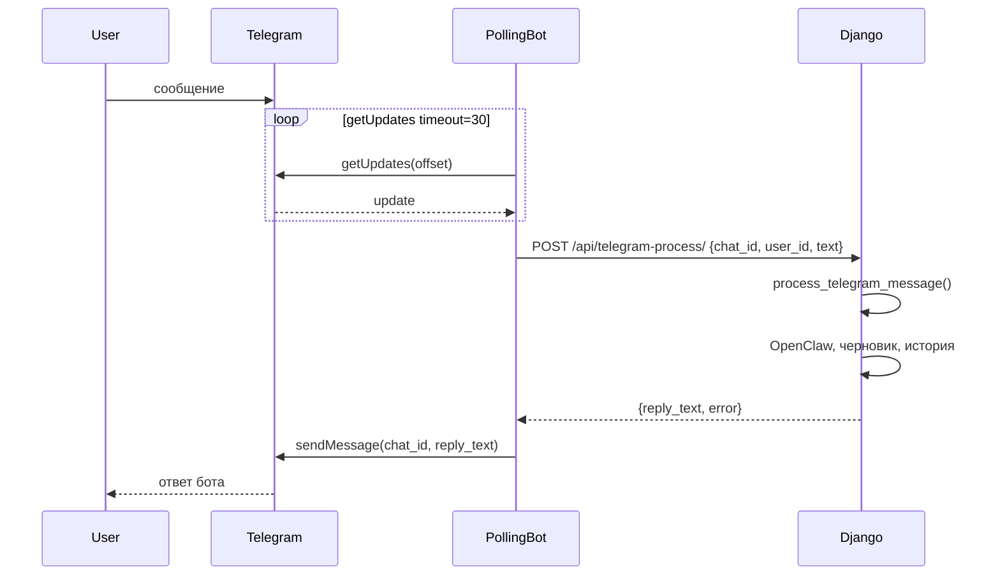

# План: отдельный бот на long polling (вариант A)

## Архитектура

Вебхук и polling **взаимоисключающие** для одного бота: при включённом polling вебхук у бота не задаётся (или сбрасывается), чтобы обновления шли только в getUpdates.

---

## 1. Вынести обработку сообщения в отдельную функцию

**Файл:** [proposals/telegram_webhook.py](proposals/telegram_webhook.py)

- Добавить функцию `**process_telegram_message(chat_id, user_id, text)`**, возвращающую `(reply_text, error)`:
  - если `text == '/start'` — вернуть `('Здравствуйте. Я помогу сформировать ТКП...', None)`;
  - если `not text` — вернуть `('', None)` (бот может не слать ничего);
  - иначе: `get_or_create_draft`, `_build_instructions`, история из кэша + добавление текущего сообщения, `_call_openclaw`, при успехе — `_append_to_history(user_id, 'assistant', reply_text)` и вернуть `(reply_text, None)`, при ошибке — `(None, err)`.
- Текущий `**telegram_webhook_view**` оставить как есть, но внутри вызывать `process_telegram_message`, затем по результату — `_telegram_send_message(chat_id, reply_text or err)` и `return HttpResponse('ok')`.

Так вебхук и новый endpoint будут использовать одну и ту же логику без дублирования.

---

## 2. Внутренний endpoint для процесса polling

**Файлы:** [proposals/api_views.py](proposals/api_views.py), [proposals/api_urls.py](proposals/api_urls.py)

- В **api_views** добавить view, например `**telegram_process_view`**:
  - метод POST;
  - тело JSON: `{"chat_id": int, "user_id": int, "text": str}`;
  - проверка авторизации через существующий `**_api_key_required**` (заголовок `X-API-Key` или `Authorization: Bearer` с `TKP_TELEGRAM_API_KEY`);
  - вызов `process_telegram_message(chat_id, user_id, text)` (импорт из `telegram_webhook`);
  - ответ JSON: `{"reply_text": str | null, "error": str | null}`. Если есть `error`, бот отправит его пользователю; если есть `reply_text` — его.
- В **api_urls** добавить маршрут, например: `path('telegram-process/', api_views.telegram_process_view)`.

Endpoint предназначен для вызова только с того же хоста (polling-ботом) и защищён API-ключом. В Nginx не обязательно выносить этот путь наружу: бот может дергать `http://127.0.0.1:8000/api/telegram-process/` (порт gunicorn из [DEPLOY.md](DEPLOY.md) — 8000).

---

## 3. Скрипт long polling

**Новый файл:** например `scripts/telegram_polling_bot.py` (или `proposals/telegram_polling_bot.py` в корне приложения).

- Зависимости: только **httpx** (уже в [requirements.txt](requirements.txt)).
- Переменные окружения (из .env или systemd):
  - `TELEGRAM_BOT_TOKEN` — токен бота;
  - `TELEGRAM_PROCESS_URL` — URL endpoint обработки, например `http://127.0.0.1:8000/api/telegram-process/`;
  - `TKP_TELEGRAM_API_KEY` — ключ для заголовка при вызове Django.
- Логика:
  - в цикле: `GET https://api.telegram.org/bot<token>/getUpdates?offset=<offset>&timeout=30`;
  - для каждого `update` с `message`/`edited_message` и `message.text`: извлечь `chat_id`, `user_id`, `text`;
  - `POST TELEGRAM_PROCESS_URL` с JSON `{chat_id, user_id, text}` и заголовком `X-API-Key: TKP_TELEGRAM_API_KEY`;
  - из ответа взять `reply_text` и/или `error`; отправить пользователю то, что есть: `sendMessage(chat_id, reply_text or error or "Не удалось получить ответ.")`;
  - обновить `offset = update.update_id + 1`;
  - при любых сетевых/ошибках — логировать, не падать (следующая итерация цикла).
- Запуск: `python scripts/telegram_polling_bot.py` (или через `python -m`). Скрипт не должен зависеть от Django (только HTTP), чтобы его можно было запускать отдельным процессом без загрузки приложения.

При необходимости скрипт может читать `.env` через простой парсер (по одной строке `KEY=value`) или полагаться на то, что systemd передаёт переменные из `EnvironmentFile`.

---

## 4. Деплой и конфигурация

**Файл:** [DEPLOY.md](DEPLOY.md)

- Добавить раздел «ТКП Telegram: режим long polling» (рядом с текущим «ТКП через Telegram»):
  - указать, что вебхук и polling — альтернативы: при использовании polling вебхук не задавать или сбросить (`setWebhook` с пустым `url`);
  - перечисление переменных: `TELEGRAM_BOT_TOKEN`, `TELEGRAM_PROCESS_URL` (например `http://127.0.0.1:8000/api/telegram-process/`), `TKP_TELEGRAM_API_KEY`;
  - команда запуска скрипта и пример unit systemd для сервиса `tkp_telegram_polling` (WorkingDirectory, EnvironmentFile, ExecStart на venv python и скрипт, Restart=always);
  - проверка: отправить боту сообщение и убедиться, что приходит ответ.

Опционально: в том же разделе кратко описать, когда выбирать вебхук (есть публичный HTTPS, нужна масштабируемость), когда polling (нет HTTPS для бота, проще поднять один процесс).

---

## 5. Что не менять

- **Вебхук** не удалять: он остаётся вторым вариантом подключения.
- **Очередь ответов в БД** не вводить: выбран синхронный вариант (endpoint возвращает ответ в теле запроса, бот сразу шлёт его в Telegram).
- **Вариант B** (бот со своей логикой и прямыми вызовами OpenClaw/БД) не реализовывать в этом плане.

---

## Порядок внедрения

1. Рефакторинг в `telegram_webhook.py`: ввести `process_telegram_message`, перевести вебхук на её вызов.
2. Добавить `telegram_process_view` и маршрут в API.
3. Реализовать скрипт long polling.
4. Обновить DEPLOY.md (инструкция + опционально systemd unit).
5. Проверка: запуск скрипта, сброс вебхука, обмен сообщениями с ботом.

