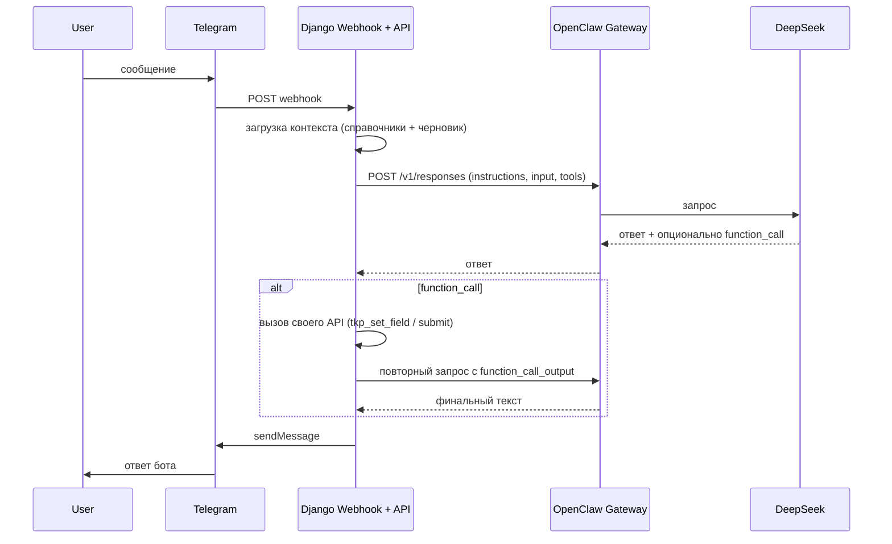

# План: ТКП через Telegram с OpenClaw (DeepSeek)

## Архитектура

- **Django**: вебхук для Telegram, API для справочников и инструментов ТКП, хранилище черновиков.
- **OpenClaw**: только вызовы с нашей стороны (POST /v1/responses). Подключение Telegram к OpenClaw не используется в этом сценарии — Telegram общается с нашим ботом (вебхук в Django).

В первой итерации — только **простое ТКП** (одна услуга); комплексное ТКП можно добавить во второй фазе.

---

## 1. Общий модуль выбора (choices) и экспорт справочников

**Цель:** единый источник для «внутренние клиенты» и «сроки», чтобы и форма, и контекст OpenClaw совпадали.

- Добавить [proposals/choices.py](proposals/choices.py):
  - `INTERNAL_CLIENT_CHOICES` — список кортежей (value, label), перенести из [proposals/forms.py](proposals/forms.py) (строки 28–35).
  - `SROK_CHOICES` — перенести из [proposals/forms.py](proposals/forms.py) (строки 100–107).
- В [proposals/forms.py](proposals/forms.py) заменить хардкод на импорт из `choices`.
- Добавить в `proposals` модуль (например [proposals/tkp_reference.py](proposals/tkp_reference.py)):
  - Функция `get_tkp_reference_data()`: возвращает dict с ключами `services` (id, name, unit_type), `regions` (id, name), `internal_clients`, `srok_choices` — данные из БД и `choices.py`.
  - Функция `format_tkp_reference_for_prompt(data)` — форматирует этот dict в текст для вставки в `instructions` (чтобы модель предлагала только эти варианты).

Зависимости: только существующие модели `Service`, `Region` и новый `choices.py`.

---

## 2. Хранение черновика ТКП по сессии (Telegram)

**Цель:** хранить состояние диалога по пользователю Telegram между запросами.

- Новая модель в [proposals/models.py](proposals/models.py), например `TkpTelegramDraft`:
  - `telegram_user_id` (CharField, индекс), `telegram_chat_id` (CharField) — для отправки ответа.
  - Поля, дублирующие данные ТКП: `is_internal` (bool), `date` (DateField, null), `service_id` (FK to Service, null), `region_id` (FK to Region, null), `internal_client`, `internal_price`, `client`, `room`, `s`, `srok`, `text` — все опциональные, где нужно — null/blank.
  - `payload` (JSONField) — сырые значения для гибкости (дата строкой, id и т.д.).
  - `updated_at` (DateTimeField, auto_now=True).
- Миграция для новой модели.
- Сервисный слой в [proposals/tkp_draft_service.py](proposals/tkp_draft_service.py):
  - `get_or_create_draft(telegram_user_id, telegram_chat_id)` — вернуть или создать черновик.
  - `set_field(draft, field_name, value)` — обновить поле (с базовой валидацией: дата, число для s/internal_price, id для service/region).
  - `get_draft_state_for_prompt(draft)` — вернуть текст/структуру «что заполнено / что пусто» для контекста OpenClaw.
  - `build_proposal_data_from_draft(draft)` — собрать словарь в формате `proposal_data` (как в [proposals/views.py](proposals/views.py) `_build_proposal_data_from_form_cleaned`): date, service_id, service_name, city, price, client, room, srok, text, s. Расчёт цены: при внешнем заказчике — по RegionServicePrice; при внутреннем — internal_price. При нехватке данных возвращать None и сообщение об ошибке.
  - `submit_draft(draft, user=None)` — вызвать `_save_tkp_record(proposal_data, status=STATUS_DRAFT, user=user)` и при успехе очистить/удалить черновик или пометить «завершён».
  - `submit_final(draft, user=None)` — вызвать `_generate_and_save_files(proposal_data)`, затем `_save_tkp_record(proposal_data, status=STATUS_FINAL, user=user)`, вернуть номер документа / base_name; при успехе очистить черновик.

Вызовы `_save_tkp_record` и `_generate_and_save_files` оставить в [proposals/views.py](proposals/views.py) и импортировать в сервис (либо вынести их в общий модуль, например `proposals/tkp_generation.py`, чтобы не завязывать сервис на request).

---

## 3. API для OpenClaw: справочники и инструменты ТКП

**Цель:** дать мосту (и при необходимости Skill) читать справочники и выполнять действия над черновиком без веб-форм.

- Новый namespace URL, например `api/` в [tkp_generator/urls.py](tkp_generator/urls.py): `path('api/', include('proposals.api_urls'))`.
- [proposals/api_urls.py](proposals/api_urls.py) и представления в [proposals/api_views.py](proposals/api_views.py) (или в одном файле).
- Аутентификация: API-ключ в заголовке (например `X-API-Key`) или Bearer, проверка в middleware или декораторе; ключ хранить в `settings`/`.env` (например `TKP_TELEGRAM_API_KEY`).
- Эндпоинты:
  - **GET api/tkp/reference/** — вернуть JSON из `get_tkp_reference_data()`. Нужен для формирования контекста на стороне моста.
  - **POST api/tkp/draft/** — тело: `{ "telegram_user_id", "telegram_chat_id" }`. Создать/получить черновик, вернуть `draft_id` (pk) и текущее состояние (поля + список заполненных/незаполненных).
  - **POST api/tkp/draft/****/set-field/** — тело: `{ "field", "value" }`. Вызвать `tkp_draft_service.set_field`. Вернуть обновлённое состояние или ошибку валидации.
  - **POST api/tkp/draft/****/submit-draft/** — сохранить как черновик в перечне ТКП. Вернуть номер черновика; очистить сессию черновика.
  - **POST api/tkp/draft/****/submit-final/** — сформировать итоговое ТКП (файлы + запись). Вернуть номер документа, при возможности путь/URL к PDF (если позже добавите раздачу файлов). Очистить черновик.

Для `submit`_* нужен `user`: либо завести системного пользователя (например по настройке `TKP_TELEGRAM_BOT_USER_ID`), либо передавать в API опциональный `user_id` от маппинга telegram_user_id → User (позже).

---

## 4. Логика «моста»: Telegram webhook + вызов OpenClaw

**Цель:** получать обновления от Telegram, формировать контекст для DeepSeek и обрабатывать ответы/вызовы инструментов.

- В [proposals/views.py](proposals/views.py) (или отдельный модуль [proposals/telegram_webhook.py](proposals/telegram_webhook.py)):
  - View для вебхука Telegram: `POST /telegram/webhook/`. Проверка секрета/токена (Telegram передаёт в URL или проверять подпись). Из тела брать `message.chat.id`, `message.from.id`, `message.text`.
  - Игнорировать не-текстовые сообщения (или обрабатывать команду /start — приветствие и сброс черновика по желанию).
- Логика одного оборота диалога (вынести в функцию или класс в том же модуле):
  1. По `telegram_user_id` и `telegram_chat_id` получить/создать черновик (через API или напрямую `tkp_draft_service.get_or_create_draft`).
  2. Собрать `instructions`: справочники (`format_tkp_reference_for_prompt`) + текущее состояние черновика (`get_draft_state_for_prompt`) + фиксированный блок правил диалога (кратко: внутренний/внешний заказчик; обязательные поля; предлагать только значения из списков; для произвольного текста — принять ввод; в конце предложить «Сохранить черновик» или «Сформировать ТКП»).
  3. Собрать `input`: история сообщений (user/assistant). Хранить историю в сессии (Django cache по ключу telegram_user_id) или в модели (отдельная таблица сообщений) с ограничением по длине (последние N пар). Текущее сообщение пользователя добавить в конец.
  4. Описание tools в формате OpenResponses: `tkp_set_field` (field, value), `tkp_get_state`, `tkp_submit_draft`, `tkp_submit_final`. В описаниях указать, что вызывать после ответа пользователя для фиксации выбора или ввода.
  5. Вызвать OpenClaw: `POST <OPENCLAW_GATEWAY_URL>/v1/responses` с `user` = telegram_user_id (или стабильный session key), `instructions`, `input`, `tools`. Использовать `requests` или `httpx`; URL и токен OpenClaw — из настроек (например `OPENCLAW_GATEWAY_URL`, `OPENCLAW_API_KEY`).
  6. Разобрать ответ: текст для пользователя; при наличии `function_call` — выполнить соответствующий запрос к своему API (set_field, submit_draft, submit_final), получить результат, отправить в OpenClaw ещё один запрос с `function_call_output`, взять итоговый текст ответа.
  7. Отправить итоговый текст в Telegram (метод `sendMessage`). При необходимости обрезать длинные сообщения или разбивать на несколько.
- Настройки в [tkp_generator/settings.py](tkp_generator/settings.py) (или .env): `TELEGRAM_BOT_TOKEN`, `TELEGRAM_WEBHOOK_SECRET` (опционально), `OPENCLAW_GATEWAY_URL`, `OPENCLAW_API_KEY`, `TKP_TELEGRAM_API_KEY` (если вебхук вызывает API по тому же ключу — можно не дублировать).
- Регистрация вебхука в Telegram: при деплое один раз вызвать `setWebhook` с URL вида `https://ваш-домен/telegram/webhook/`. Описать в [DEPLOY.md](DEPLOY.md) шаг настройки бота и вебхука.

---

## 5. Конфигурация OpenClaw и промпт

- OpenClaw на VM уже развёрнут с DeepSeek; дополнительно настраивать модель не обязательно, если эндпоинт `/v1/responses` уже доступен.
- Включить в конфиге OpenClaw `gateway.http.endpoints.responses.enabled: true` (если ещё не включено).
- Системный блок правил диалога (вставляется в `instructions` при каждом запросе) хранить в коде (константа или шаблон в [proposals/tkp_reference.py](proposals/tkp_reference.py) / отдельный файл), например:
  - Сначала уточнить: внутренний или внешний заказчик.
  - Для внешнего: дата, услуга (только из списка), регион (из списка), площадь/количество (число), наименование клиента (текст), срок (из списка), объект и произвольный текст — по желанию.
  - Для внутреннего: дата, услуга, внутренний клиент (из списка), стоимость (число).
  - После заполнения обязательных полей предложить сохранить черновик или сформировать ТКП и вызвать соответствующий инструмент.
  - Не придумывать значения для полей-справочников — только из переданного списка.

---

## 6. Зависимости и деплой

- В [requirements.txt](requirements.txt) добавить `httpx` (или `requests`) для вызовов OpenClaw и Telegram API.
- В [DEPLOY.md](DEPLOY.md) добавить раздел «ТКП через Telegram»:
  - Создание бота в BotFather, получение токена, добавление в .env.
  - Установка вебхука (curl с `setWebhook`).
  - Переменные: `OPENCLAW_GATEWAY_URL`, `OPENCLAW_API_KEY`, `TELEGRAM_BOT_TOKEN`, при необходимости `TKP_TELEGRAM_API_KEY`.
  - Проверка: отправить боту сообщение и убедиться, что приходит ответ от ассистента и при завершении диалога ТКП появляется в перечне (или черновик).

---

## 7. Порядок внедрения (кратко)

1. Добавить [proposals/choices.py](proposals/choices.py) и [proposals/tkp_reference.py](proposals/tkp_reference.py); обновить [proposals/forms.py](proposals/forms.py).
2. Модель `TkpTelegramDraft`, миграция, сервис [proposals/tkp_draft_service.py](proposals/tkp_draft_service.py); при необходимости вынести `_save_tkp_record` / `_generate_and_save_files` в общий модуль для вызова из сервиса.
3. API: URL, аутентификация, эндпоинты reference, draft, set-field, submit-draft, submit-final.
4. Вебхук Telegram и логика моста (формирование instructions, вызов OpenClaw, обработка function_call, отправка ответа в Telegram).
5. Конфиг и документация в DEPLOY.md; тестирование на VM.

После этого пользователь сможет вести диалог с ботом в Telegram; OpenClaw (DeepSeek) будет опираться на заложенные в ТКП справочники и правила, а создание записей и файлов ТКП — выполняться в Django через существующую логику.